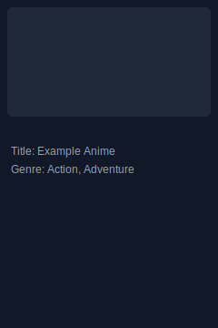
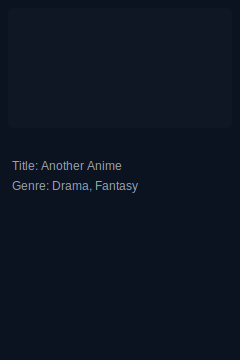

# Unsupervised Learning Project


<!-- Hero thumbnails (replace these SVGs with your images if desired) -->
<p align="center">
	
	
	
	
	
</p>

## Table of contents

- [Project Overview](#project-overview)
- [Dataset](#dataset)
- [Packages](#packages)
- [Environment](#environment)
- [Team Members](#team-members)

## Project Overview

This repository contains resources and starter code for unsupervised learning experiments (clustering, dimensionality reduction, content-based recommendation pipelines). The repo is organized so you can quickly run notebooks and reproduce the analyses.

## Dataset

The project expects the following CSV files in `data/`:

- `anime.csv` — metadata about items (anime): `anime_id,name,genre,type,episodes,rating,members`
- `train.csv` — ratings from users (for model development): `user_id,anime_id,rating`
- `test.csv` — pairs for prediction/competition format: `user_id,anime_id`

Example small description and column definitions are included in the `data/` folder as starter files.

## Packages

Install required packages:

```
pip install -r requirements.txt
```

Core packages used: `pandas`, `numpy`, `scikit-learn`, `matplotlib`, `jupyter`.

## Environment

Recommended: create a conda environment and install dependencies.

```powershell
conda create --name unsupervised python=3.9
conda activate unsupervised
pip install -r requirements.txt
```

## Team Members

| Name | Email |
|------|-------|
| Team Member 1 | boiza.express@gmail.com |

---

If you'd like, I can add a sample notebook that runs PCA + KMeans and a `src/` helper module with tests next.
